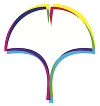

# 東京大学LGBTQ+教職員会

東京大学LGBTQ+教職員会は、東京大学に所属するセクシュアル・マイノリティである教職員を中心とした団体です。メンバーの親睦、情報交換、東京大学のLGBTQに関する環境改善のための働きかけを目的としています。在学生中心のUT-topos、卒業生中心のPorta Rubra for LGBT@UT、アライと共に活動するTOPIAの各団体と連携して活動しています。定期的に親睦会を開催しているので、どうぞ遠慮なくご連絡下さい。

[ご連絡](mailto:euan.mckay@mail.u-tokyo.ac.jp)

# University of Tokyo LGBTQ+ staff association

University of Tokyo LGBTQ+ staff association is an organization for faculty and administrative staff at the University of Tokyo who identify as belonging to a sexual minority. We aim to provide mutual support for members and offer a space for information exchange and focus efforts to lobby for improvements to the university environment for sexual minorities. We actively collaborate with the student organisation UT-Topos, alumni organization Porta Rubra for LGBT @ UT, and TOPIA, which works together with allies. Please feel free to get in touch and join us for one of our regular social gatherings.

[Contact us](mailto:euan.mckay@mail.u-tokyo.ac.jp).

